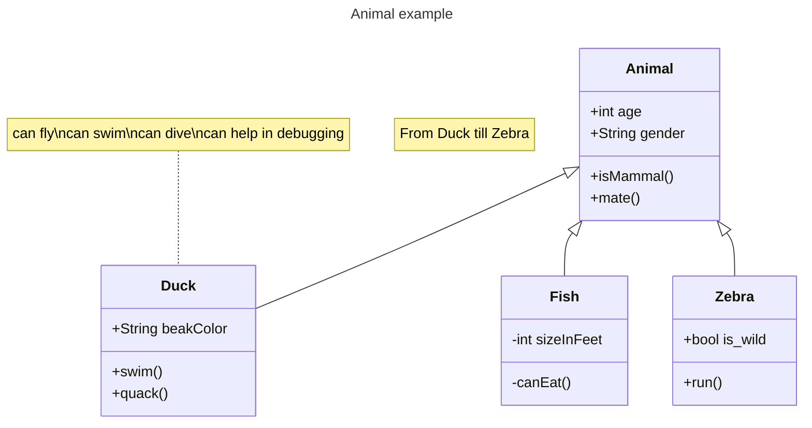

## Variation of the problem
  * ATM design
  * Logger design
  * Design vending machine (asked in amazon frequently)

## Concept in a NutShell

   ```
        This of an linkedList where you nee to specify who will be 
        the next in line. Extend a common class or an common interface
        and chain all the child classes one by one like this
        
        > new InfoLogger(new ErrorLogger(new DebugLogger(null)));
   ```

